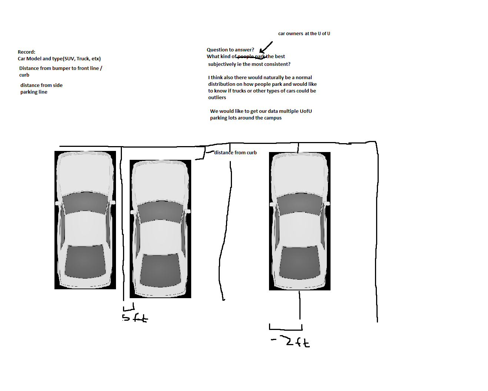

Gabriel Bautista and Blake Van Dyken

```{r setup, include=FALSE}
knitr::opts_chunk$set(echo = TRUE)
```

```{r echo=FALSE}
#load csvs
MEB_Parking <- read.csv("resources/MEB Parking Lot.csv")
Union_Parking <- read.csv("resources/Union Parking Lot.csv")
Student_Store_Parking <- read.csv("resources/Student Store Parking Lot.csv")
All_Parking <- rbind(MEB_Parking, Student_Store_Parking, Union_Parking)

```

<h1> Introduction <h1/>
We are were walking through the parking lot one day after stats class and looked over at a car that was parked awfully. We wondered, "why did that person park so poorly? Could it be because he is driving a small Toyota?" This gave us our final project idea. We wanted to find out what is the reason for all these awful parkers around campus. The question we then dedicated our life to answering was "What kind of car owners at the University of Utah park the best?" This will help us figure out who we should park next too and who to avoid for the rest of our time at the University. Below we have supplied the first idea sketch we made.




<h1> The Imperfections Of Our Study</h1>
While collecting our data we realized where the pitfalls were.

Without recording the license plat of the car (some cars also having temp plates) we could not know if we were measuring the same persons car twice. We tried to minimize this problem by measuring multiple parking lots that did not access the same group of buildings in the hope that this coincidence would not happen. 

We had to consider what was the "curb". While the parking lot at the student store and The Union had an island in front of each space meaning cars would not be front to front allowing them to park slightly worse without any penalty. On the other hand the parking in MEB just had a line dividing the front making cars park more carefully (hopefully) and not as far forward.

The cars in each parking lot could park facing the curb or facing the opposite side, thus many large cars with large trunks would have negative measurements.

We also had no way to tell if the persons car we were measuring attended the University as a student, staff, faculty, or if they were just visiting. We have no way to tell if this person would ever return to the campus or if parking there was a one time thing.

We did not measure any handicap spots in the parking lots we were at so we cannot consider that in our final conclusion.

Not all parking spaces are the same size. Each parking lot we measured we added a parking space size. Even with recording the parking space size parking spots inside the same parking lot can very in sizes. Corner spots tend to have more space because they are up agains a side curb while spots on a bend can be "crushed" because the space available. 

The last constraint we had on this study was time, it took roughly an hour to measure each parking lot, or ~1 hour per 100 cars. We do not have enough time to measure every single parking space at the Univerity of Utah so we picked the largest and most dense/popular parking lots to take our measurements from.

<h1> Data Collection Process </h1>
There are many ways that we could have collected data from the car parking lots, but to answer our question we recorded a few measurements. Listed below is how we decided to measure cars in the parking spots:
<ul>
  <li>We used a 25 ft tape measure and rounded our results to the nearest half inch</li>
  <li>Measured the distance from the left side of the parking spot to the front door handle</li>
  <li>Measured the distance from the right side of the parking spot to the front door handle</li>
  <li>Measured the distance from the front license plate to the curb or to the front line of the parking spot
  <li>A positive measurement is how far from the inside of the parking line the car is, and a negative measurement is how far over the car was from the inside of the line</li>
  <li>Recorded the size of the car (small, medium, or large)</li>
  <li>Recorded the make of the car (subaru, toyota, etc.)</li>
  <li>Recorded the state of the license plate</li>
  <li>We also measured the size of one of the parking spots in each lot</li>
</ul>

We wanted to choose parking lots that would give us the most random selection of cars, thus we chose the most popular and high traffic parking lots at the University of Utah:
<ul>
  <li>Merrill Engineering Building Parking Lot</li>
  <li>Student Union Parking Lot</li>
  <li>University Campus Store Parking Lot</li>
</ul>

We decided 100 cars per parking lot was a good sample size, and we measured each lot on a different days and at different times to make the sample more random.


<h1> Analysis <h1/>

```{r echo=FALSE}
#all parking lots together

# this gets the average of each type of car measurements
acura_left_avg <- mean(All_Parking$left[grep("acura", All_Parking$make)])
acura_right_avg <- mean(All_Parking$right[grep("acura", All_Parking$make)])
acura_curb_avg <- mean(All_Parking$curb[grep("acura", All_Parking$make)])

audi_left_avg <- mean(All_Parking$left[grep("audi", All_Parking$make)])
audi_right_avg <- mean(All_Parking$right[grep("audi", All_Parking$make)])
audi_curb_avg <- mean(All_Parking$curb[grep("audi", All_Parking$make)])

bmw_left_avg <- mean(All_Parking$left[grep("bmw", All_Parking$make)])
bmw_right_avg <- mean(All_Parking$right[grep("bmw", All_Parking$make)])
bmw_curb_avg <- mean(All_Parking$curb[grep("bmw", All_Parking$make)])

buick_left_avg <- mean(All_Parking$left[grep("buick", All_Parking$make)])
buick_right_avg <- mean(All_Parking$right[grep("buick", All_Parking$make)])
buick_curb_avg <- mean(All_Parking$curb[grep("buick", All_Parking$make)])

chevy_left_avg <- mean(All_Parking$left[grep("chevy", All_Parking$make)])
chevy_right_avg <- mean(All_Parking$right[grep("chevy", All_Parking$make)])
chevy_curb_avg <- mean(All_Parking$curb[grep("chevy", All_Parking$make)])

chrysler_left_avg <- mean(All_Parking$left[grep("chrysler", All_Parking$make)])
chrysler_right_avg <- mean(All_Parking$right[grep("chrysler", All_Parking$make)])
chrysler_curb_avg <- mean(All_Parking$curb[grep("chrysler", All_Parking$make)])

dodge_left_avg <- mean(All_Parking$left[grep("dodge", All_Parking$make)])
dodge_right_avg <- mean(All_Parking$right[grep("dodge", All_Parking$make)])
dodge_curb_avg <- mean(All_Parking$curb[grep("dodge", All_Parking$make)])

ford_left_avg <- mean(All_Parking$left[grep("ford", All_Parking$make)])
ford_right_avg <- mean(All_Parking$right[grep("ford", All_Parking$make)])
ford_curb_avg <- mean(All_Parking$curb[grep("ford", All_Parking$make)])

gmc_left_avg <- mean(All_Parking$left[grep("gmc", All_Parking$make)])
gmc_right_avg <- mean(All_Parking$right[grep("gmc", All_Parking$make)])
gmc_curb_avg <- mean(All_Parking$curb[grep("gmc", All_Parking$make)])

honda_left_avg <- mean(All_Parking$left[grep("honda", All_Parking$make)])
honda_right_avg <- mean(All_Parking$right[grep("honda", All_Parking$make)])
honda_curb_avg <- mean(All_Parking$curb[grep("honda", All_Parking$make)])

hyundai_left_avg <- mean(All_Parking$left[grep("hyundai", All_Parking$make)])
hyundai_right_avg <- mean(All_Parking$right[grep("hyundai", All_Parking$make)])
hyundai_curb_avg <- mean(All_Parking$curb[grep("hyundai", All_Parking$make)])

infiniti_left_avg <- mean(All_Parking$left[grep("infiniti", All_Parking$make)])
infiniti_right_avg <- mean(All_Parking$right[grep("infiniti", All_Parking$make)])
infiniti_curb_avg <- mean(All_Parking$curb[grep("infiniti", All_Parking$make)])

jeep_left_avg <- mean(All_Parking$left[grep("jeep", All_Parking$make)])
jeep_right_avg <- mean(All_Parking$right[grep("jeep", All_Parking$make)])
jeep_curb_avg <- mean(All_Parking$curb[grep("jeep", All_Parking$make)])

kia_left_avg <- mean(All_Parking$left[grep("kia", All_Parking$make)])
kia_right_avg <- mean(All_Parking$right[grep("kia", All_Parking$make)])
kia_curb_avg <- mean(All_Parking$curb[grep("kia", All_Parking$make)])

lexus_left_avg <- mean(All_Parking$left[grep("lexus", All_Parking$make)])
lexus_right_avg <- mean(All_Parking$right[grep("lexus", All_Parking$make)])
lexus_curb_avg <- mean(All_Parking$curb[grep("lexus", All_Parking$make)])

lexus_left_avg <- mean(All_Parking$left[grep("lexus", All_Parking$make)])
lexus_right_avg <- mean(All_Parking$right[grep("lexus", All_Parking$make)])
lexus_curb_avg <- mean(All_Parking$curb[grep("lexus", All_Parking$make)])

lincoln_left_avg <- mean(All_Parking$left[grep("lincoln", All_Parking$make)])
lincoln_right_avg <- mean(All_Parking$right[grep("lincoln", All_Parking$make)])
lincoln_curb_avg <- mean(All_Parking$curb[grep("lincoln", All_Parking$make)])

maserati_left_avg <- mean(All_Parking$left[grep("maserati", All_Parking$make)])
maserati_right_avg <- mean(All_Parking$right[grep("maserati", All_Parking$make)])
maserati_curb_avg <- mean(All_Parking$curb[grep("maserati", All_Parking$make)])

mazda_left_avg <- mean(All_Parking$left[grep("mazda", All_Parking$make)])
mazda_right_avg <- mean(All_Parking$right[grep("mazda", All_Parking$make)])
mazda_curb_avg <- mean(All_Parking$curb[grep("mazda", All_Parking$make)])

mercedes_left_avg <- mean(All_Parking$left[grep("mercedes", All_Parking$make)])
mercedes_right_avg <- mean(All_Parking$right[grep("mercedes", All_Parking$make)])
mercedes_curb_avg <- mean(All_Parking$curb[grep("mercedes", All_Parking$make)])

mitsubishi_left_avg <- mean(All_Parking$left[grep("mitsubishi", All_Parking$make)])
mitsubishi_right_avg <- mean(All_Parking$right[grep("mitsubishi", All_Parking$make)])
mitsubishi_curb_avg <- mean(All_Parking$curb[grep("mitsubishi", All_Parking$make)])

nissan_left_avg <- mean(All_Parking$left[grep("nissan", All_Parking$make)])
nissan_right_avg <- mean(All_Parking$right[grep("nissan", All_Parking$make)])
nissan_curb_avg <- mean(All_Parking$curb[grep("nissan", All_Parking$make)])

porche_left_avg <- mean(All_Parking$left[grep("porche", All_Parking$make)])
porche_right_avg <- mean(All_Parking$right[grep("porche", All_Parking$make)])
porche_curb_avg <- mean(All_Parking$curb[grep("porche", All_Parking$make)])

ram_left_avg <- mean(All_Parking$left[grep("ram", All_Parking$make)])
ram_right_avg <- mean(All_Parking$right[grep("ram", All_Parking$make)])
ram_curb_avg <- mean(All_Parking$curb[grep("ram", All_Parking$make)])

saturn_left_avg <- mean(All_Parking$left[grep("saturn", All_Parking$make)])
saturn_right_avg <- mean(All_Parking$right[grep("saturn", All_Parking$make)])
saturn_curb_avg <- mean(All_Parking$curb[grep("saturn", All_Parking$make)])

subi_left_avg <- mean(All_Parking$left[grep("subi", All_Parking$make)])
subi_right_avg <- mean(All_Parking$right[grep("subi", All_Parking$make)])
subi_curb_avg <- mean(All_Parking$curb[grep("subi", All_Parking$make)])

tesla_left_avg <- mean(All_Parking$left[grep("tesla", All_Parking$make)])
tesla_right_avg <- mean(All_Parking$right[grep("tesla", All_Parking$make)])
tesla_curb_avg <- mean(All_Parking$curb[grep("tesla", All_Parking$make)])

toyota_left_avg <- mean(All_Parking$left[grep("toyota", All_Parking$make)])
toyota_right_avg <- mean(All_Parking$right[grep("toyota", All_Parking$make)])
toyota_curb_avg <- mean(All_Parking$curb[grep("toyota", All_Parking$make)])

volvo_left_avg <- mean(All_Parking$left[grep("volvo", All_Parking$make)])
volvo_right_avg <- mean(All_Parking$right[grep("volvo", All_Parking$make)])
volvo_curb_avg <- mean(All_Parking$curb[grep("volvo", All_Parking$make)])

vw_left_avg <- mean(All_Parking$left[grep("vw", All_Parking$make)])
vw_right_avg <- mean(All_Parking$right[grep("vw", All_Parking$make)])
vw_curb_avg <- mean(All_Parking$curb[grep("vw", All_Parking$make)])
```